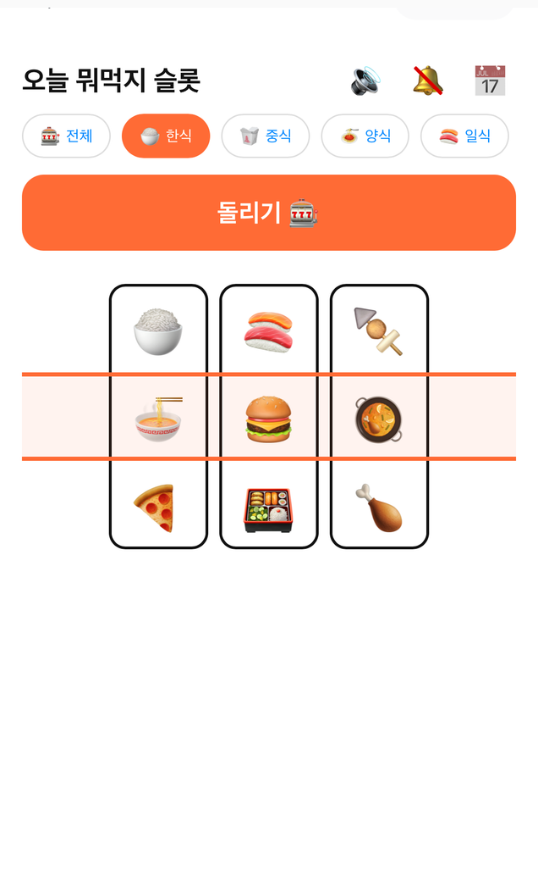
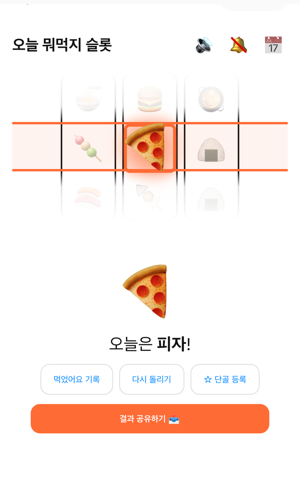

# 🎰 오늘 뭐먹지 슬롯 (Lunch Slot)

> 점심 메뉴 고민을 **슬롯머신으로 5초에** 끝내주는 앱인토스(Apps in Toss) 미니앱.
> 앱인토스 2026 6월 바이브코딩 챌린지("일상이 편해지는 순간") 출품작.

<p align="center">
  
</p>

매일 반복되는 "점심 뭐 먹지?"라는 결정 피로를, 슬롯을 돌리는 즐거운 5초 경험으로 자동화했습니다.

---

## ✨ 주요 기능

- **3후보 → 1당첨 슬롯**: 세 릴이 서로 다른 후보(가중 당첨 1 + 미끼 2)에 순차 정지 → 셀렉터가 가운데 히트 셀을 오가다 마지막 불규칙 감속으로 당첨에 안착 → 당첨 팝 연출
- **확률 가중치 추첨**: 최근 먹은 메뉴는 덜, 즐겨찾기는 더 — "또 같은 거" 방지 (recency decay + favorite boost)
- **메뉴 246종** · 카테고리 8종 · 주간 점심 기록 · 단골 즐겨찾기 · 결과 공유 · 햅틱/사운드
- **하이브리드 아이콘 시스템**: 메뉴별 일러스트(없으면 이모지 폴백). 식당 연동·사용자 추가 메뉴까지 대비한 4단계 리졸버

## 📱 스크린샷

<p align="center">
  
  &nbsp;&nbsp;
  
  &nbsp;&nbsp;
  
</p>

---

## 🛠 기술 스택

`React 19` · `Vite 6` · `TypeScript` · `@apps-in-toss/web-framework 2.6` (WebView 미니앱) · `Vitest`

## 🧱 아키텍처

```
ohneul-slot/src/
├── data/         정적 데이터 — menus(246) / categories / menuImages(매니페스트+리졸버)
├── core/         순수 로직(플랫폼/React 無, Vitest 대상)
│   ├── picker      가중치 추첨 + pickThree(3후보→1당첨)
│   ├── history-util 주간 집계·중복·날짜 수학(UTC)
│   └── menuMatch   이름 정규화 + 표준 메뉴 매칭
├── platform/     앱인토스 API 격리 — storage/haptic/sound/share/notify (폴백 내장)
├── store/        useAppState (영속화)
└── components/   SlotMachine · MenuIcon · CategoryPicker · ResultCard · HistoryView
```

**설계 원칙**: `core/`는 순수 함수로 분리해 단위 테스트, 플랫폼 의존은 `platform/` 어댑터에 격리(로컬 폴백 포함).

## 🎨 메뉴 아이콘 파이프라인

메뉴 아이콘은 **Recraft V3**로 생성합니다 — 묘사 기반 프롬프트(`scripts/menu-prompts.json`)로 식별성을 확보하고, 배경 제거로 투명 처리, 매니페스트 자동 동기화. 아이콘이 없는 메뉴는 `resolveMenuIconUrl`의 4단계 폴백(전용 → 이름 정규화 매칭 → 카테고리 제너릭 → 이모지)으로 처리해 **열린 메뉴 집합**(식당/사용자 추가)에도 대응합니다.

## ✅ 품질

- **Vitest 31개 통과** (추첨 분포·날짜 경계·정규화 매칭 등 순수 로직)
- `tsc --noEmit` 클린 · `vite build` 정상
- 서브에이전트 주도 개발 + 스펙/코드품질 2단계 리뷰로 구현

## 🚀 실행

```bash
cd ohneul-slot
npm install
npm test          # 단위 테스트
npm run dev       # = granite dev (앱인토스 샌드박스 앱으로 접속해 확인)
npm run build     # = ait build → .ait 번들
```

## 📂 문서

- 설계: [`docs/superpowers/specs/`](docs/superpowers/specs) · 구현 계획: [`docs/superpowers/plans/`](docs/superpowers/plans)
- 진행 기록: [`progress.md`](progress.md)

---

<sub>앱인토스 챌린지 출품작 · 개인 프로젝트</sub>
